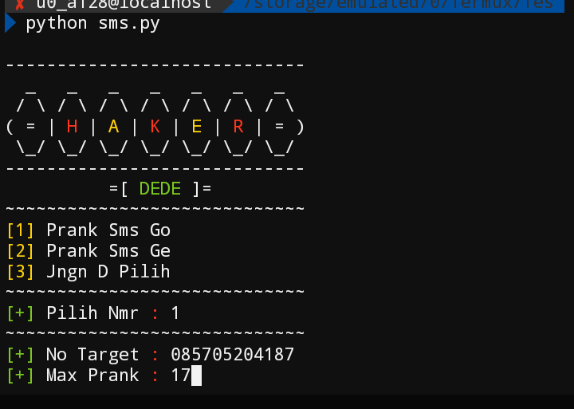

<details open>
<summary>    [ CARA INSTALL ] </summary>

- ```
 apt update &&apt upgrade -y
```

- ```
 apt install python
```

- ```
  pip install --upgrade pip
```

- ```
  pip install requests
```

- ```
  git clone https://github.com/TermuxArt/IklanSms
```

- ```
  cd IklanSms
```

- ```
 python sms.py
```


# Image

